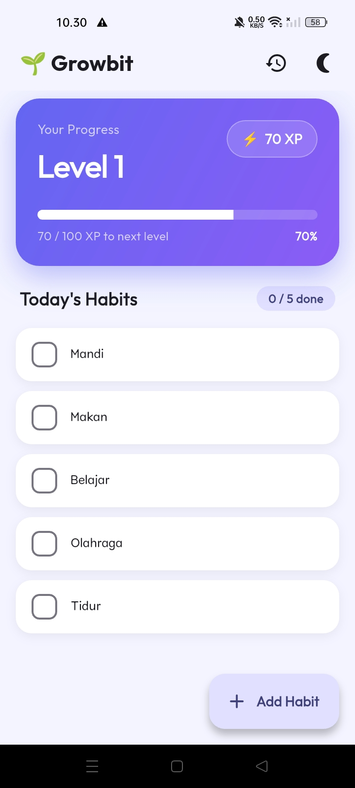
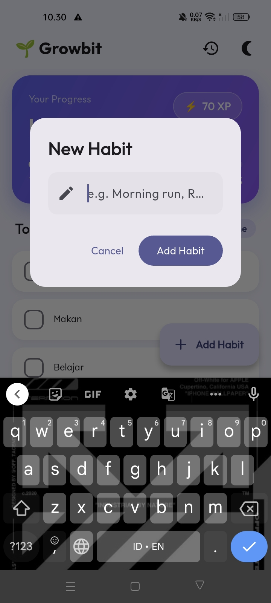
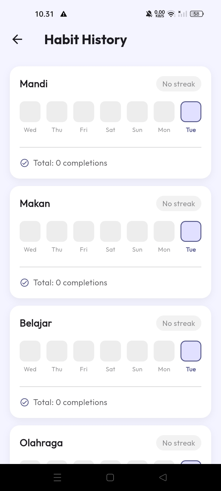

# 🌱 Growbit

**Growbit** is a gamified habit tracker mobile application built with Flutter.  
Build better habits, earn XP, level up, and track your consistency — all in one place.

---

## ✨ Features

- **Habit Management** — Add and manage your daily habits with ease.
- **Daily Tracking** — Mark habits done each day with smooth animated feedback.
- **Gamification (XP & Levels)** — Earn +10 XP per completed habit and level up as you progress.
- **Animated XP Progress Bar** — Watch your progress fill up in real-time with a percentage indicator.
- **Streak Tracking** — Every habit card shows your current 🔥 consecutive-day streak.
- **Habit History & Analytics** — View a 7-day completion calendar and total completions per habit.
- **Anti-Farming System** — Smart daily reset prevents XP exploitation and enforces real consistency.
- **Dark Mode** — Fully themed light/dark mode with persistent preference saved locally.
- **Data Persistence** — All progress is safely stored on-device using Shared Preferences.

---

## 🛠 Tech Stack

| Layer | Technology |
|---|---|
| **Framework** | Flutter |
| **Language** | Dart |
| **State Management** | Provider |
| **Storage** | Shared Preferences |
| **Typography** | Google Fonts (Outfit) |

---

## 🎯 Roadmap & Progress

✅ **Completed:**
- Core habit management (add & toggle)
- XP & leveling system with level-up notifications
- Animated XP progress bar with percentage display
- Streak tracking per habit
- Habit history screen with 7-day mini-calendar & analytics
- Modernized UI with gradient header, smooth animations, and Outfit font
- Full dark mode with persistent theme preference
- Anti XP farming & daily reset systems
- Data persistence with local storage

⏳ **Future Ideas:**
- Push notifications for daily habit reminders
- Habit categories and tagging
- Weekly/monthly analytics charts
- Cloud sync & backup

---

## 📸 Preview

  
  &nbsp;&nbsp;&nbsp;&nbsp;
  
  &nbsp;&nbsp;&nbsp;&nbsp;
  

---

## 🤝 Contributing

This is a personal portfolio project by **Risto**, built to demonstrate Flutter mobile development skills.  
Forks and Pull Requests are always welcome for learning purposes!